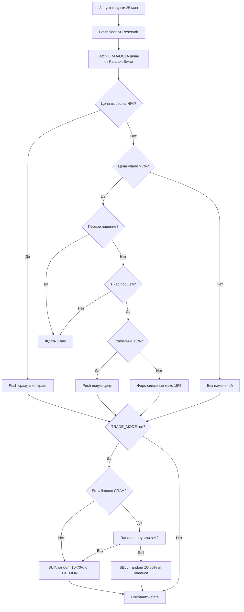

# CrazyOctagon Smart Bot 🐙

Автоматический бот для обновления цен и торговли на Monad testnet.

## Возможности

### 1. Умное обновление цен (Anti-Dump)
- **Рост цены → мгновенный push** в контракт (если изменение > 5%)
- **Падение цены → задержка 1 час**:
  - Если цена стабилизировалась (±5%) → push
  - Если продолжает падать → форс-снижение (макс 15% за шаг)
- Алгоритм из `monahapanceeeebot` — защита от дампа

### 2. Рандомная торговля
- **7 вариантов покупки**: 10%, 20%, 30%, 40%, 50%, 60%, 70% от базовой суммы (0.01 MON)
- **6 вариантов продажи**: 10%, 20%, 30%, 40%, 50%, 60% от купленного
- Продажа всегда меньше покупки (нет ситуации "нечего продавать")
- Отслеживание баланса WMON и CRAA

### 3. Цены только с PancakeSwap
- Первичный источник: `PANCAKE_FACTORY` (0x82438CE666d9403e488bA720c7424434e8Aa47CD)
- Fallback: явные пулы из `.env`

## Установка

```bash
cd bot_local_monad
npm install
```

## Конфигурация

Скопируй `.env` и настрой переменные:

```env
# Основные адреса (уже настроены)
RPC_URL=https://testnet-rpc.monad.xyz
NFT_COLLECTION=0x4bcd4aff190d715fa7201cce2e69dd72c0549b07
CRAA_TOKEN=0x7D7F4BDd43292f9E7Aae44707a7EEEB5655ca465
OCTA_TOKEN=0xB4832932D819361e0d250c338eBf87f0757ed800
WMON_TOKEN=0x760AfE86e5de5fa0Ee542fc7B7B713e1c5425701
PANCAKE_FACTORY=0x82438CE666d9403e488bA720c7424434e8Aa47CD

# !!! ДОБАВЬ ПРИВАТНЫЕ КЛЮЧИ !!!
ORACLE_PK=                    # Приватный ключ с ролью PRICER_ROLE
TRADER_PK=                    # Приватный ключ для торговли (или тот же что ORACLE_PK)

# Anti-dump настройки (можно оставить дефолтные)
MIN_CHANGE_PCT=0.05           # 5% минимальное изменение
DECREASE_DELAY_MS=3600000     # 1 час задержка при падении
PENDING_TOL_PCT=0.05          # 5% допуск стабильности
MAX_STEP_DOWN_PCT=0.15        # 15% макс снижение за шаг

# Торговля
TRADE_MODE=off                # off | on
BASE_TRADE_MON=0.01           # Базовая сумма для покупки (в MON)
TRADE_SLIPPAGE_BPS=500        # 5% slippage
```

## Запуск

### Локальный тест (dry-run):
```bash
node push_prices.js
```

### Реальный запуск (применяет изменения):
```bash
node push_prices.js --apply
```

## GitHub Actions (автозапуск каждые 25 минут)

### 1. Добавь секреты в репозиторий:
- Settings → Secrets and variables → Actions → New repository secret
  - `ORACLE_PK` — приватный ключ оракула
  - `TRADER_PK` — приватный ключ для торговли

### 2. (Опционально) Добавь переменные:
- Settings → Secrets and variables → Actions → Variables
  - `TRADE_MODE` = `on` (включить торговлю)
  - `BASE_TRADE_MON` = `0.01` (сумма покупки)

### 3. Workflow запускается автоматически:
- Каждые 25 минут (cron: `*/25 * * * *`)
- Или вручную: Actions → CrazyOctagon Price Bot → Run workflow

## Логика работы



## Файлы

- `push_prices.js` — основной скрипт
- `.env` — конфигурация
- `../data/bot_state.json` — состояние (history, pending, trade balance)
- `../data/bot_price_*.json` — лог цен

## Примеры вывода

### Рост цены:
```
📈 RISE (>5.0%) → instant push
📤 Push (LIVE):
  setManualFloor(520000000000000000)
  setCRARateManual(4266700000000000000000000000)
  Floor tx: 0x123...
  CRAA tx: 0x456...
```

### Падение (ожидание):
```
⏳ FALL → wait 60min
```

### Торговля:
```
🛒 BUY 40% of 0.01 = 0.004000 MON
  Expected: 5021087.234 CRAA
  Tx: 0x789...
  ✅ Bought

💰 SELL 30% of 5021087.234 = 1506326.170 CRAA
  Expected: 0.0012 WMON
  Tx: 0xabc...
  ✅ Sold
```

## Безопасность

⚠️ **НИКОГДА не коммить `.env` с приватными ключами!**

- `.env` уже в `.gitignore`
- Используй GitHub Secrets для CI/CD
- Проверяй баланс кошелька перед включением `TRADE_MODE=on`

## Мониторинг

Проверяй логи в GitHub Actions:
- Actions → CrazyOctagon Price Bot → Latest run
- Смотри секцию "Run smart bot" для деталей

Локально смотри `data/bot_state.json`:
```json
{
  "lastCraaAmount": 4266700000,
  "lastOctaAmount": 10428794053,
  "lastPushAt": 1759567907794,
  "trade": {
    "balance": 0.006,
    "craaBalance": 3014652.34,
    "lastAction": "sell"
  },
  "history": [...]
}
```

## Troubleshooting

### "No ORACLE_PK - skipping push"
→ Добавь `ORACLE_PK` в `.env` или GitHub Secrets

### "No pair for 0x..."
→ Проверь что `PANCAKE_FACTORY` и `CRAA_WMON_POOL`/`OCTA_WMON_POOL` заданы

### "Nothing to sell"
→ Нормально, если баланс CRAA = 0. Бот пропустит продажу и купит в следующий раз

### GitHub Actions не запускается
→ Проверь cron синтаксис (`*/25 * * * *`) и что workflow включён (Actions → Enable workflow)

---

**Готово!** Бот умный, безопасный, и готов к деплою 🚀

## Daemon (локальный запуск каждые 25 минут)

Если вы хотите запускать `push_prices.js --apply` локально по расписанию без использования GitHub Actions, есть простой helper `run_daemon.js`.

Пример запуска в PowerShell (в папке `deploy-bot/bot_local_monad`):

```powershell
# Убедитесь, что .env настроен с RPC и ключами
node run_daemon.js
```

`run_daemon.js` создаёт `daemon.lock` чтобы предотвратить множественные инстансы и логирует вывод в `../data/daemon_*.log`.

Рекомендация для продакшена: используйте `systemd`, `pm2` или другой supervisor и храните приватные ключи в защищённом хранилище.

